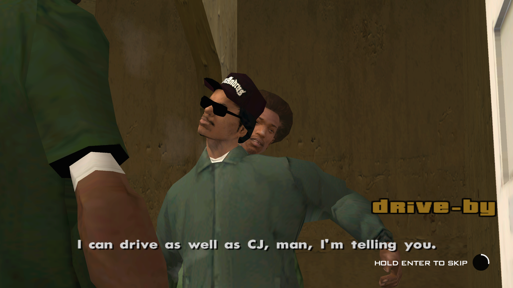

# Mission Hold Skipper

An .asi plugin for GTA San Andreas v1.0 US that turns the instant mission scene
skip into a hold to skip action. Instead of a single tap on ENTER, you hold the
key and a small circular prompt in the bottom right corner fills up. Let go
early and nothing is skipped.

## Screenshot



Mid hold during the Drive-By cutscene, at 1920x1080. The white arc has swept
about a third of the way around the black circle, and the label sits to its left
so it stays clear of the subtitles.

## Requirements

- GTA San Andreas v1.0 US, `gta_sa.exe` with md5 `170b3a9108687b26da2d8901c6948a18`
- An ASI loader, for example the one that ships with Silent's ASI Loader or Ultimate ASI Loader

The plugin checks a few known byte patterns in the executable on startup. On any
other version it logs the mismatch and stays completely inactive instead of
patching memory it does not recognise.

## Install

Grab the zip from the Releases page, or build it yourself as described below.

Copy `MissionHoldSkipper.asi` and `MissionHoldSkipper.ini` into your GTA San
Andreas folder, next to `gta_sa.exe`, or into the `scripts` folder if your loader
uses one. Both files have to sit in the same directory.

A log is written next to the .asi as `MissionHoldSkipper.log`. It records the
version check, the screen size, and where the prompt was drawn, which is the
first place to look if something does not appear.

## Configuration

Everything lives in `MissionHoldSkipper.ini` under the `[MissionHoldSkipper]`
section. Values are read once at startup.

- `Enabled`: `0` leaves the game completely untouched.
- `HoldMs`: how long the key has to be held, in milliseconds. Default `1200`.
- `Keys`: any of `ENTER`, `NUMPAD_ENTER`, `SPACE`, `MOUSE_LEFT`, comma separated.
- `ShowHintBeforeHold`: `1` shows the prompt as soon as a scene can be skipped,
  `0` only shows it while a key is held.
- `Label`: the text next to the circle. Set it to nothing to hide the text.
- `FadeInMs`, `FadeOutMs`: show and hide easing in milliseconds.
- `RingX`, `RingY`: position in 640x448 units. `-1` means the bottom right corner.
- `RingRadius`, `RingThickness`, `RingSegments`: size and smoothness of the circle.
- `LabelScaleX`, `LabelScaleY`: text size.
- `ColorBackdrop`, `ColorTrack`, `ColorProgress`: colours as `RRGGBBAA`. The
  backdrop is the black disc, progress is the white fill sweeping around the rim,
  and the track is the unfilled part of the rim, invisible by default.
- `LogLevel`: `debug`, `info`, `warn` or `error`.

## Building

The plugin is a 32 bit Windows DLL. On Linux it cross compiles with Conan and
msvc-wine, using the toolchain file that ships with msvc-wine.

```bash
conan install . -pr:h=./conanprofile-wine.txt -pr:b=default --build=missing -of build
cmake --preset conan-release
cmake --build --preset conan-release
```

The result is `build/build/Release/MissionHoldSkipper.asi`, with the ini copied
next to it. Only `KERNEL32.dll` is linked, since the runtime is static.

The geometry and the hold timer contain no game memory access, so they build and
run natively:

```bash
cmake -S . -B build-tests -G Ninja -DMHS_BUILD_TESTS=ON
cmake --build build-tests
ctest --test-dir build-tests --output-on-failure
```

## How it works

Every skip path in the game funnels through
`CCutsceneMgr::IsCutsceneSkipButtonBeingPressed` at `0x4D5D10`, so that single
function is replaced. It now reports a press only on the frame the hold timer
completes, and it keeps the vanilla behaviour of skipping automatically while the
game sits in the background.

A scene counts as skippable when a cutscene is running or when any active
`CRunningScript` has a non zero `m_SceneSkipIP`, which is exactly the field
`CRunningScript::Process` checks before it jumps past a scene.

Drawing happens through the call to `CHud::Draw` inside `Render2dStuff`, which is
repointed rather than hooked at the callee, so the original function stays
reachable without a trampoline. The circle is built from segmented triangle fans
handed to `CSprite2d::Draw2DPolygon`, and the label goes through `CFont`.


## License

MIT, see [LICENSE](LICENSE).